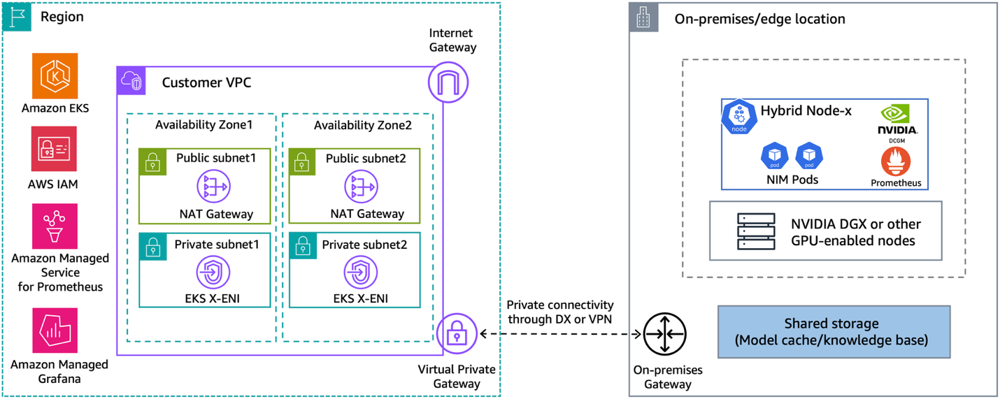

# EKS Hybrid Nodes + NVIDIA DGX (Spark) — walkthrough notes

This folder holds manifests and Helm values used while following:

**[Deploy production generative AI at the edge using Amazon EKS Hybrid Nodes with NVIDIA DGX](https://aws.amazon.com/blogs/containers/deploy-production-generative-ai-at-the-edge-using-amazon-eks-hybrid-nodes-with-nvidia-dgx/)**

You can use the networking and EKS related values I used as reference when following the AWS guide.

Note: the examples don't include the monitoring implementation (Prometheus and Grafana)

---

## Prerequisites (from the post)

- VPC layout, EKS cluster **with hybrid nodes enabled**, and **private connectivity** (VPN or Direct Connect) between on‑prem and the cluster VPC.
- Distinct, routable **`RemoteNodeNetwork`** and **`RemotePodNetwork`** CIDRs; security groups and firewalls opened per [EKS Hybrid Nodes networking prerequisites](https://docs.aws.amazon.com/eks/latest/userguide/hybrid-nodes-networking.html).
- On‑prem GPU system (e.g. DGX Spark) running a supported OS.
- **NGC** account and API key for NIM images.
- **Helm 3.9+**, **kubectl**, **AWS CLI**, **eksctl** (as in the article).

